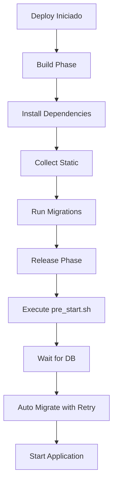

# 🔄 Migração Automática no Deploy

Este documento explica como o sistema de migração automática funciona para garantir que o banco de dados seja sempre atualizado a cada deploy.

## 📋 Processo de Deploy

### 1. Build Phase (`build.sh`)
```bash
#!/usr/bin/env bash
set -o errexit

# Install dependencies
pip install -r requirements.txt

# Collect static files
python manage.py collectstatic --noinput

# Run migrations
python manage.py migrate

echo "Build completed successfully!"
```

### 2. Release Phase (`Procfile`)
```
release: ./pre_start.sh
web: gunicorn sms_sender.wsgi --log-file -
worker: celery -A sms_sender worker --loglevel=info
beat: celery -A sms_sender beat --loglevel=info
```

### 3. Pre-Start Script (`pre_start.sh`)
```bash
#!/usr/bin/env bash
echo "🔄 Iniciando processo de migração automática..."

# Verificar se o banco de dados está pronto
./wait_for_db.sh

# Executar migrações com retry automático
python manage.py auto_migrate --max-retries=5 --retry-delay=3

echo "🚀 Migrações concluídas! Aplicação pronta para iniciar..."
```

## 🛠️ Componentes

### `wait_for_db.sh`
- Verifica se o banco de dados está acessível
- Tenta até 30 vezes com delay de 2 segundos
- Falha graciosamente se o banco não estiver disponível

### `auto_migrate` (Django Command)
- Comando personalizado que executa migrações com retry
- Configurável: `--max-retries` e `--retry-delay`
- Lida com falhas de conexão temporárias
- Log detalhado do processo

### Configuração do Banco
```python
# settings.py
DATABASES['default'].update({
    'CONN_MAX_AGE': 600,  # Conexões persistentes
    'OPTIONS': {
        'connect_timeout': 10,
        'server_side_binding': True,
    }
})
```

## 🔍 Fluxo Completo



## 📊 Logs Esperados

### Sucesso
```
🔄 Iniciando processo de migração automática...
🔍 Verificando se o banco de dados está pronto...
✅ Banco de dados está pronto!
📊 Executando migrações do banco de dados com retry...
🔄 Tentativa 1/5 - Testando conexão...
🔄 Executando migrações...
Operations to perform:
  Apply all migrations: admin, auth, contenttypes, sessions, webhooks
Running migrations:
  No migrations to apply.
✅ Verificando status das migrações...
✅ Migrações executadas com sucesso!
🚀 Migrações concluídas! Aplicação pronta para iniciar...
```

### Com Retry
```
📊 Tentativa 1/5 - Testando conexão...
⚠️  Tentativa 1 falhou: could not connect to server
⏳ Aguardando 3s antes da próxima tentativa...
📊 Tentativa 2/5 - Testando conexão...
✅ Migrações executadas com sucesso!
```

## 🚨 Troubleshooting

### Problema: Migrações não aplicadas
**Solução**: Verificar logs do release phase no Render

### Problema: Timeout de conexão
**Solução**: Aumentar `--max-retries` ou verificar configuração do banco

### Problema: Permissões de arquivo
**Solução**: Verificar se scripts têm permissão de execução:
```bash
chmod +x pre_start.sh wait_for_db.sh
```

## ✅ Verificação

Para verificar se as migrações estão funcionando:

1. **Deploy**: Fazer um commit e push
2. **Logs**: Verificar logs no Render Dashboard
3. **Health Check**: `GET /api/webhooks/health/`
4. **Debug**: `GET /api/webhooks/debug/`

## 🔧 Comandos Úteis

```bash
# Executar migração local
python manage.py auto_migrate

# Verificar status das migrações
python manage.py showmigrations

# Força migração (endpoint)
POST /api/webhooks/force-migrate/
```

## 📈 Benefícios

- ✅ **Automático**: Não requer intervenção manual
- ✅ **Resiliente**: Retry automático em falhas temporárias
- ✅ **Monitorado**: Logs detalhados de cada etapa
- ✅ **Seguro**: Verifica conexão antes de executar
- ✅ **Configurável**: Timeouts e tentativas ajustáveis
